# Basketball-in-the-Bubble
An investigation into the unique experience of the 2020 NBA Post Season (or Playoffs), which took place in an isolated zone, or "Bubble", within the Disneyworld Campus in Florida. 

# Table of Contents
* [Overview](##Overview)
    * [Personal Motivation](##-Pesonal-Motivation)
    * [Question](##Question)
* [Data Sources](#Data-Source)
    * [Data Clean Up](##Data-Clean-Up)
* [Exploratory Data Analysis](#Exploratory-Data-Analysis)
    * [Initial EDA](##Initial-EDA)
    * [EDA: Home Court Advantage and Margin of Victory](##EDA:-Home-Court-Advantage-and-Margin-of-Victory)
    * [EDA: Shooting Statistics](##EDA:-Shooting-Statistics)
    * [EDA: Offensive Rating (ORtg) and Defensive Rating (DRtg)](##EDA:-Offensive-Rating-(ORtg)-and-Defensive-Rating-(DRtg))
* [Hypothesis Testing](#Hypothesis-Testing)
    * [Home Court Advantage and Margin of Victory](##Home-Court-Advantage-and-Margin-of-Victory)
    * [Free Throw Percentage Changes from the Regular Season to the Bubble](##-Free-Throw-Percentage-Changes-from-the-Regular-Season-to-the-Bubble)
    * [Offensive Rating (ORtg)](##-Offensive-Rating-(ORtg))
    * [Defensive Rating (DRtg)](##-Offensive-Rating-(DRtg))
* [Further Investigations](#Further-Investigations)
* [In Summary](#In-Sumamry:)

## Overview
Inquisitive basketball fans typically perform an "eye-test" for certain players, teams, or even conferences. An "eye-test" is a subjective measurement to gauge a subject's performance (ie. "After watching that buzzer beater in the Bubble, Luka Doncic is the best player in the NBA"). There is a lot of feeling that goes into making these assertions, as well as personal bias. The 2020 NBA Playoffs, commonly known as "The Bubble", offered a once-in-a-lifetime experience for teams, providing them an environment free from distraction. No fans loudly cheering in a raucous arena, no front-row big shots heckling players in the middle of the game, and no opportunity to leave or travel outside of the Disneyworld Campus. 

## Pesonal Motivation
I have been a lifelong NBA fan ever since my dad introduced me at a young age. I grew up a Los Angeles Lakers fan, my dad's favorite team, and as I grew to love the sport of basketball, I came to fully appreciate each and every game played. I like to believe that my "eye-test" for players is generally on the mark. The Bubble was one of the most exciting moments in NBA history. Many fans believed this year's Playoffs to be "basketball in it's purest form", where players operated at peak performance. 

## Question
Within this controlled environment, I will explore if the 2020 NBA Playoffs prove to be a statistical anomally from the 2020 Regular Season.

# Data Source
* [Basketball Reference Web Scraper API Python Package](https://github.com/vishaalagartha/basketball_reference_scraper)
    * 2018-2019 Individual Player Game Logs, Regular and Post Season
    * 2019-2020 Individual Player Game Logs, Regular and Post Season
    * 2019-2020 Team Ratings

## Data Clean-Up
The Web Scraping API, though powerful, was not initially meant for pulling records of multiple players at a time. The Player Log include a lookup feature utilizing the Levenshtein distance to vectorize the string of a player being looked up, and how close that matched a name found within the database. This process also involved User Input and Acceptance to process, so I had to manually reconfigure the functionality to decrease the Levenshtein distance within the lookup, and minimize as much user input as possible. 

This should have been an easy process, since I was feeding in the same Player Names that I had retrieved using the same API, so the names would be a 1:1 match of what was in the system.

I came into errors with different types of syntax being passed through the Player Lookup function. String characters such as an apostraphe ('), period (.), hyphen (-), Jr's, and III's, through the reconfigured lookup function for a loop. 

There were odd use cases of player names not matching the predetermined URL naming convention that I had to manually create exceptions for. This seemed to be an issue of the webpage, not the API's functionality.

Lastly, since I was using Player Rosters for a given year, there were repeats of Player Names, as players can be traded to different teams throughout the season. Though the Player Lookup returns that Player's entire game log for the season, regardless of their team, it would have bogged down my data set with repeated information. So I dropped duplicate Player Names, keeping the First instance of when it was found in the data set. 

By accounting for these special use cases, I was able to successfully import the Player Rosters for the 2019 and 2020 Season (Regular + Post), and retrieve each player's individual Game Log. 

# Exploratory Data Analysis
During my initial EDA, I looked at the data from multiple points of view. I compared the 2020 Post Season to the 2019 Regular Season, 2020 Post Season to 2019 Post Season, the delta from 2019 Regular Season to 2019 Post Season compared to the delta of the 2020 Regular Season to the 2020 Post Season. 

Each season's Regular Season Game Logs provided about 40,000 rows of individual Player Logs (82 Games across 500-600 players each year). By subsetting the Regular Season's Game Logs with only the players that appear in the Playoff Game Logs, I focused the data set to about 12,000 rows per Regular Season Year.

The Playoff game logs amounted to about 1,200 rows per year, for a total of over **25,000** rows of data. 

The datasets include over 25 features, such as, such as categorial information likePlayer Name, Team, Opponent and Minutes Played. Dimensionally, all of the counting stats were provided, such as Points, Rebounds (Offensive and Defensive), Assits, Steals, Blocks, Turnovers, and Personal Fouls. I also added the calculation for TS% as provided in the Basketball-Reference Glosary, https://www.basketball-reference.com/about/glossary.html. 

* Categorical:
    * 'NAME', 'DATE', 'AGE', 'TEAM', 'HOME/AWAY', 'OPPONENT', 'RESULT', 'GS', 'MP'
* Shooting Statistics:
    * 'FG', 'FGA', 'FG%', '3P', '3PA', '3P%', 'FT', 'FTA', 'FT%'
* Counting Stats:
    * 'ORB','DRB', 'TRB', 'AST', 'STL', 'BLK', 'TOV', 'PF', 'PTS'
* Advanced: 
    * 'GAME_SCORE','+/-', 'TSA', 'TS%'

## Initial EDA
Comparing the average amount of points scored in Post Seasons:

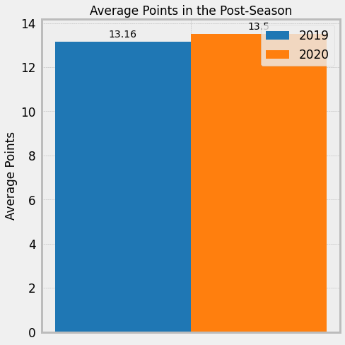

Comparing FG% between Post Seasons:

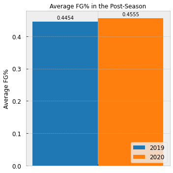

My first pass through of EDA involved 1:1 comparisons of Post-Seasons to each other. Looking at the counting stats, I realized that condensing all of the entire data into one singular metric to chart, did not provide quite enough context to pull meaningful insight from.

As I began to shift my plotting from bar charts to histograms, I started to get a better look into the data.

Distribution of Points scored in 2019 vs 2020 Post Season:

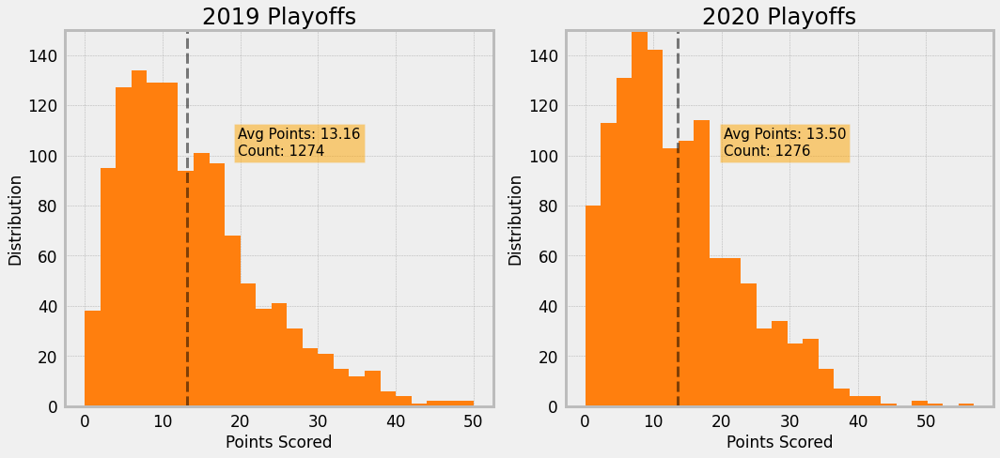

Because there were many different ways to look into the data, I decided to split up my focus for EDA into three sections:
* Home/Away Court Status and Margin of Victory
* Shooting Statistics
* Offensive/Defensive Rating and Pace

## EDA: Home Court Advantage and Margin of Victory
Walking into an opponent's home territory can be a scary thing. Before the Warriors moved to San Francisco City, their Oakland stadium was aptly named, "R-Oracle Arena", due to their record breaking decibal levels. But does Home Court make a statistical difference in basketball? And if so, would removing it and leveling the playing field even out the outcomes of games? 

The Game Logs contain information if a game was played on either a HOME or AWAY court, and the resulting Margin (positive for a victory, negative for a loss). I grouped the player level data by TEAM, to aggregate the records and provide an accurate account of games played.

*Comparison of Margin of Victory for Home Games in 2019 Post Season to Home Games in 2020 Post Season*

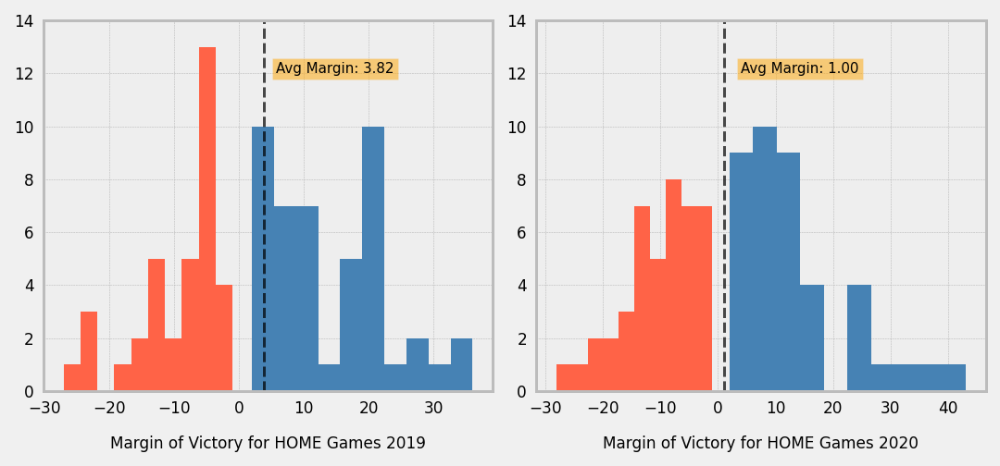

During this process, I was able to identify a decrease in the average Margin of Victory from the 2019 Post Season to the "Bubble" 2020 Season. As I wanted to be more thorough in selecting the appropriate samples to perform my hypothesis testing, I looked at the 2020 Regular Season to compare with the 2020 Post Season. I felt this would be more of an apt-comparison, and so I filtered down the 2019-2020 Game Logs to only include data from the teams that made it to the Playoffs, so that it would be more of a 1:1 comparison for hypothesis testing. 

My next look into the data examined the *distribution of Margin for Regular Season games in 2020*:

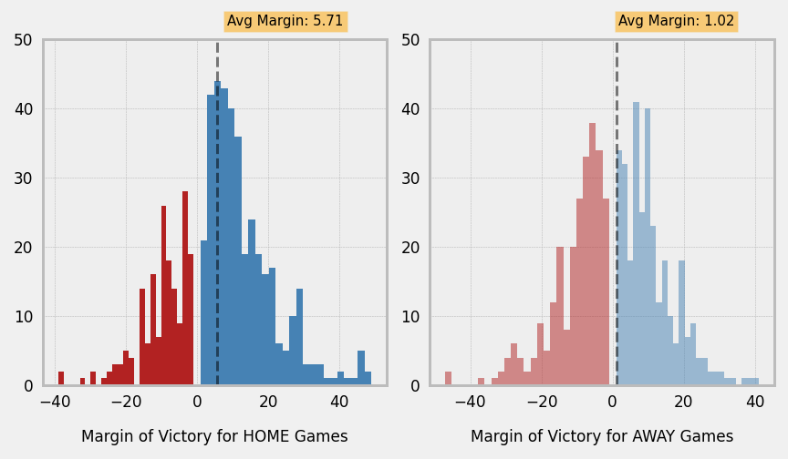

*Descriptive Stats for Margin for 2020 Regular Season*
| TEAM |  Mean  |  Std  |  Min  |  Max  |
|:----:|:------:|:-----:|:-----:|:-----:|
|  MIL |  13.31 | 13.45 | -12.0 |  47.0 |
|  PHI |   9.00 | 10.98 | -19.0 |  47.0 |
|  LAC |   8.50 | 15.44 | -26.0 |  49.0 |
|  BOS |   8.25 | 13.39 | -16.0 |  35.0 |
|  TOR |   8.00 | 15.13 | -22.0 |  46.0 |
|  LAL |   7.46 | 14.46 | -24.0 |  30.0 |
|  MIA |   6.11 | 11.26 | -11.0 |  29.0 |
|  HOU |   5.47 | 15.67 | -38.0 |  47.0 |
|  IND |   5.06 | 12.09 | -19.0 |  39.0 |
|  DAL |   4.89 | 16.54 | -29.0 |  48.0 |
|  DEN |   4.24 | 10.83 | -20.0 |  28.0 |
|  OKC |   4.22 | 12.07 | -15.0 |  29.0 |
|  UTA |   3.89 | 13.67 | -25.0 |  32.0 |
|  POR |   2.00 | 11.98 | -23.0 |  28.0 |
|  BRK |   1.78 | 15.76 | -39.0 |  41.0 |
|  ORL |  -0.34 | 15.14 | -32.0 |  34.0 |

*Margin distribution for Post Season games in 2020:*

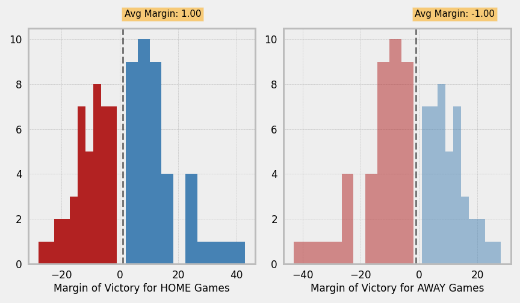

Since the Regular Season data set only focuses on game logs of players/teams in the 2020 Playoffs, the data is not mirrored because it includes records of games played against teams that do not make it into the Playoffs. The Post Season graph is mirrored, due to the game logs being an exact match: Each margin of victory is account for another team's margin of loss, and vice-versa. 

*Descriptive Stats for Margin for 2020 Post Season Home Games:*

(Keep in mind that Teams are eliminated as the tournament goes on)
| TEAM |   Mean |   Std |   Min |   Max |
|-----:|-------:|------:|------:|------:|
|  UTA |   9.00 | 25.24 | -12.0 |  37.0 |
|  LAL |   7.50 | 11.61 | -15.0 |  23.0 |
|  HOU |   7.33 | 16.92 | -10.0 |  34.0 |
|  OKC |   6.33 |  4.93 |   3.0 |  12.0 |
|  LAC |   4.43 | 21.66 | -15.0 |  43.0 |
|  BOS |   3.62 | 11.65 |  -7.0 |  27.0 |
|  MIA |   2.90 | 10.41 | -13.0 |  15.0 |
|  DEN |   0.11 | 11.13 | -19.0 |  13.0 |
|  MIL |  -0.83 | 12.38 | -12.0 |  15.0 |
|  TOR |  -3.17 | 16.63 | -22.0 |  24.0 |
|  PHI |  -6.00 |  2.83 |  -8.0 |  -4.0 |
|  DAL |  -6.67 |  8.08 | -14.0 |   2.0 |
|  IND | -10.50 |  2.12 | -12.0 |  -9.0 |
|  POR | -14.00 |  8.49 | -20.0 |  -8.0 |
|  ORL | -14.50 |  0.71 | -15.0 | -14.0 |
|  BRK | -26.50 |  2.12 | -28.0 | -25.0 |

## EDA: Shooting Statistics
At a player level, I wanted to focus on the distribution of shooting statistics available to me in the data set. There are three different types of ways to score points in basketball:
* Field-Goal    (FG): Any successful shot attempt within the 3-Point line
* 3-Pointer     (3P): Any successful shot attempt outside the 3-Point line
* Free-Throw    (FT): After a foul has been acessed, a player can take a standing shot from the Free-Throw Line, without any interruption from opposing players
All of these statistics have a Percentage associated with them, the number of made baskets divided by number of attempts.

There is also an all encompassing stat, that measures the efficiency and takes into account all three of these types of shots, called True Shooting %.

Table Summary of the Shooting Statisics of focus:

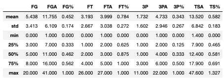

My first idea was to begin with TS%, since it takes into account all the shooting percentages into one metric. Since my data did not lend itself to meaningful time-series with the Date column (Date was arbitrary), I charted the average TS% as the number of games progreses. I wanted to see, as the teams get further into the tournament, is there any noticeable trend in their shooting.

Avg True Shooting % in 2020 Post Season along with Number of Games Played in Playoffs. The blue bars give reference to the number of records being factored into the Avg TS%. As the tournament progresses, teams are eliminated, and the data pool grows smaller. 

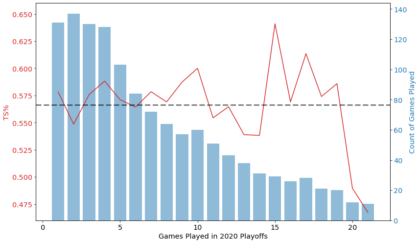

Unfortunately, TS% by Games Played did not provide me with much to go on from there. I figured the time-series route was a dead-end, and decided to try factoring in Home/Away games in my EDA. 

I began by looking at FT%, as practically, FT% seem to be affected by crowds. Players can shoot as well as they want in practice, but come time in front of a crowd, and that percentage can drop. 

Looking at the 2020 Post Season, I saw that there was a sizeable difference between FT% in Home and Away games:

|       |   2020 PS FT% | 2020 RSFT%
| ---   |   ---         | ---
| AWAY  |   0.751589    | 0.761168
| HOME  |   0.784879    | 0.761664

Off an eye-test, it seemed that Away Games in the Post Season seemed to affect FT%. I wanted to see if there was a difference from regular season to post season, factoring in Home and Away games. I brought in last year's Regular Season to Playoff change, to help give context on what a typically shift into the Post Season can bring.

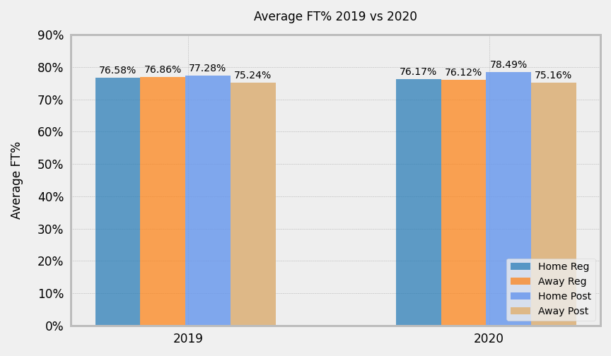

I see that going into the Bubble (2020 Home and Away Post), there is a somewhat substantial jump from 2020 Regular Season Home FT% to 2020 Post Season Home FT%. But, with my 2019 columns for reference, I have context to expect a jump there. 

## EDA: Offensive Rating (ORtg) and Defensive Rating (DRtg)
There are two succint metrics that evaluate and normalize a team's ability to score (ORtg) and defend (DRtg). These ratings are evaluated at a team level, and are normalied over a rate of 100 possesions per game (A possession is defined as the instance when a team possess the basketball, and is attempting to score). 

Simply put, you need to score more points than the other team to win. Are players more focused and does a team "get better" (ORtg goes up or DRtg goes down) in the Post Season? Or do they crumble under the pressure and choke away their chance at the championship (ORtg goes down or DRtg goes up)?

* ORtg is a reflection of how many points a team would score in 100 possessions. A higher ORtg would mean a higher score.
* DRtg is a reflection of how many points a team allowed in 100 possessions. A higher DRtg would mean opponents score more points on them.

Typically, team's with a positive Net Rating will have won more games, than those with a negative Net Rating.

Because the Bubble provided an isolated environment, teams no longer had to spend time travelling. I charted the change in Pace, of teams in the Post Season versus their Regular Season Pace. **Pace** is defined as an estimate for the number of possessions per 48 minutes by a team. Were teams more well rested, were they able to perform at a peak level (pace wise), are they hustling for longer periods of time? 

Looking at the difference in Pace of Teams within the Playoffs, it will be interesting to see if these changes translated to any statistical difference for ORtg and DRtg.

# Hypothesis Testing

## Home Court Advantage and Margin of Victory
**H0: Home Court Advantage (Margin of Victory in Home Games) is the same in the Bubble as it was in the Regular Season**

**HA: Home Court Advantage (Margin of Victory in Home Games) is different in the Bubble as it was in the Regular Season**

Based on the distribution plots, though the average Playoff Margin is much closer to 0 (or a neutral advantage). I performed a Student's T-test, comparing the margin of victory for 2020 Playoff "Home" Wins with the margin of victory for 2020 Regular Season Home Wins, and observed a p-value of 0.9867.

Using an alpha of 0.05, based on the p-values observed, I fail to reject the null hypothesis that the Home Court Advantage and Margin of Victory within the Bubble is the same as it was in the Regular Season.

## Free Throw Percentage Changes from the Regular Season to the Bubble
---
**H0: Average FT% inside the Bubble (Home/Away) is the same as the FT% from the 2020 Regular Season**

**HA: Average FT% inside the Bubble (Home/Away) is different as the FT% from the 2020 Regular Season**

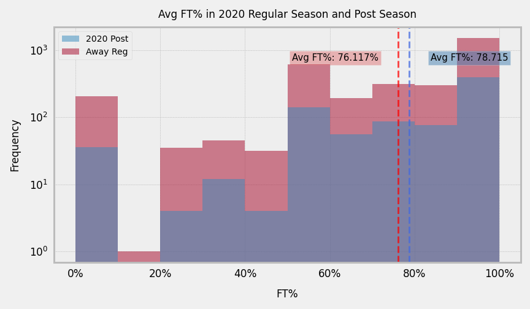

After dividing the FT% statistics over the course of Regular Season to Post Season, from 2019 and 2020, I decided to slice the data with the 2020 Post Season as one sample, compared to Away Regular season games.

Based on the distribution plots, displayed an increase in FT% for the 2020 Post Season, when performing a Student's T-test with Average FT% from 2020 Regular Season Away games, I observed a p-value of 0.472.

Using an alpha of 0.05, based on the p-values observed, I fail to reject the null hypothesis that the Average FT% inside the Bubble (Home/Away) is the same as the FT% from the 2020 Regular Season

## Offensive Rating (ORtg) 
**H0: ORtg is the same in the Bubble as the 2020 Regular Season**

**H0: ORtg is different in the Bubble as the 2020 Regular Season**

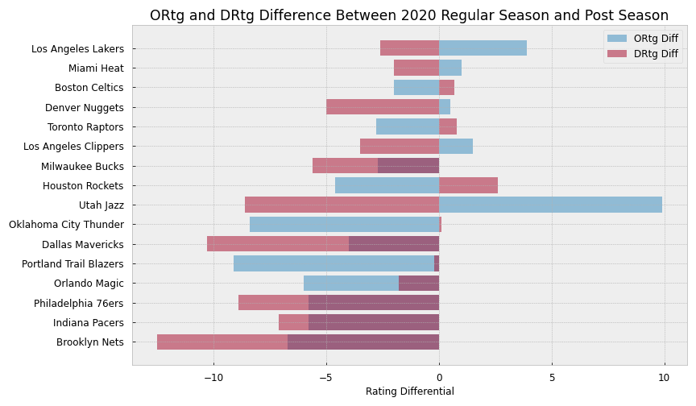

Since this data set was substantially smaller than the previous data sets, I plotted the Playoff Teams's difference of their ORtg from their Regular Season ratings. 

And since I was working on a small data set with the same indexed values, Teams, and was dealing with a difference between two samples (Post Season and Regular Season), I concluded a Mann-Whitney U test would be appropriate, using an alpha of 0.05. 

The Mann-Whitney U test produced a p-value of 0.076, so I fail to reject the null hypothesis that ORtg is the same in the Bubble as the 2020 Regular Season.

##  Defensive Rating (DRtg)
**H0: DRtg is the same in the Bubble as the 2020 Regular Season**

**H0: DRtg is different in the Bubble as the 2020 Regular Season**

Since DRtg is a positive number, I captured the positive difference (the Team is allowing more points to be scored on them on defense) as a negative value. Again, since this data set was substantially smaller than the previous data sets, I plotted the Playoff Teams's difference of their ORtg and DRtg from their Regular Season ratings. 

As stated previously, working with a smalle set of data with the same indexed values, Teams, and was dealing with a difference between two samples (Post Season and Regular Season), I concluded a Mann-Whitney U test would be appropriate, using an alpha of 0.05. 

The Mann-Whitney U test produced a p-value of 0.025, so I reject the null hypothesis that DRtg is the same in the Bubble as the 2020 Regular Season.

# Further Investigation
* Initial EDA should have been more exploratory of the data, instead of targetted with specific questions that needed data to answer.
    * Hypothesis testing could have been narrowed down to 2 or even 1 hypothesis instead of 3
    * Explore more targetted subsets (ie. How did specific Teams perform, how did certain players perform)
    * Explore a combination of FGA, Pace, ORtg/DRtg, and Margin of Victory in a way that could tie together all my hypotheses into one test
* Some graphs seemed significant, but the p-values did not, may need further investigation and more previous year's worth of data

# In Summary:
Though the 2020 NBA Playoffs in the Bubble provided some of the most exciting basketball in recent years, the once-in-a-lifetime experience did not statistically prove a difference in the margin of victory of Home wins. The isolated environment also did not prove a statistical difference in average FT% compared to the 2020 NBA Regular Season. Lastly, the contained campus, absence of air travel, and lack of night life did not have a statistical effect on team's Offensive rating, but did prove a statistical significance in Defensive rating. It seems as if contextually, teams spent more of their energy playing a different level of defense in the Bubble, which would affect the Offensive rating of the opposing team.

There can still be further investigation done, as this contained environment provides the perfect place to continue conducting hypothesis testings.
