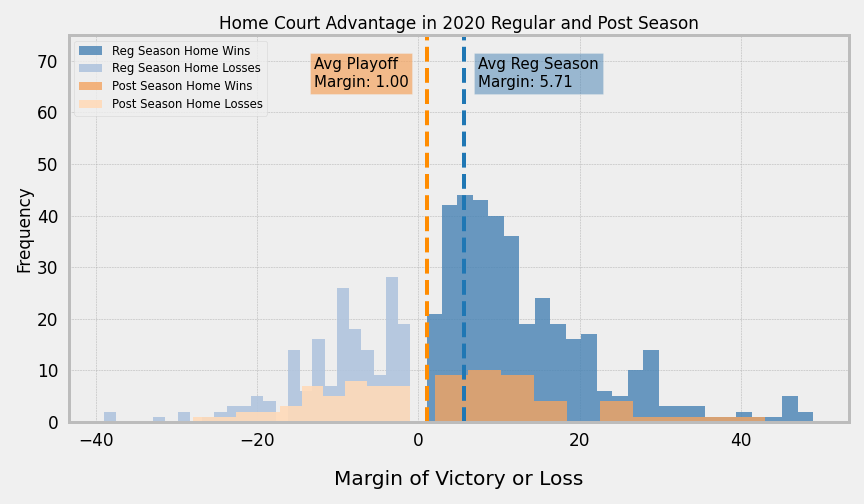

# Basketball-in-the-Bubble
An investigation into the unique experience of the 2020 NBA Post Season (or Playoffs), which took place in an isolated zone, or "Bubble", within the Disneyworld Campus in Florida. 

## Overview
___
Inquisitive basketball fans typically perform an "eye-test" for certain players, teams, or even conferences. An "eye-test" is a subjective measurement to gauge a subject's performance (ie. "After watching that buzzer beater in the Bubble, Luka Doncic is the best player in the NBA"). There is a lot of feeling that goes into making these assertions, as well as personal bias. The 2020 NBA Playoffs, commonly known as "The Bubble", offered a once-in-a-lifetime experience for teams, providing them an environment free from distraction. No fans loudly cheering in a raucous arena, no front-row big shots heckling players in the middle of the game, and no opportunity to leave or travel outside of the Disneyworld Campus. 

# Motivation
## Pesonal
I have been a lifelong NBA fan ever since my dad introduced me at a young age. I grew up a Los Angeles Lakers fan, my dad's favorite team, and as I grew to love the sport of basketball, I came to fully appreciate each and every game played. I like to believe that my "eye-test" for players is generally on the mark. The Bubble was one of the most exciting moments in NBA history. Many fans believed this year's Playoffs to be "basketball in it's purest form", where players operated at peak performance. 

## Question
Within this controlled environment, I will explore if the 2020 NBA Playoffs prove to be a statistical anomally from the 2020 Regular Season.

# Data Exploration
## Data Source
* Basketball Reference Web Scraper API Python Package: https://github.com/vishaalagartha/basketball_reference_scraper 
    * 2018-2019 Individual Player Game Logs, Regular and Post Season
    * 2019-2020 Individual Player Game Logs, Regular and Post Season
    * 2019-2020 Team Ratings

## Home Court Advantage and Margin of Victory
Walking into an opponent's home territory can be a scary thing. Before the Warriors moved to San Francisco City, their Oakland stadium was aptly named, "R-Oracle Arena", due to their record breaking decibal levels. But does Home Court make a statistical difference in basketball? And if so, would removing it and leveling the playing field even out the outcomes of games? 

The Game Logs feature if a game was played HOME or AWAY, and the resulting Margin (positive for a victory, negative for a loss)

## Shooting Statistics
There are three different types of ways to score points in basketball:
* Field-Goal    (FG): Any successful shot attempt within the 3-Point line
* 3-Pointer     (3P): Any successful shot attempt outside the 3-Point line
* Free-Throw    (FT): After a foul has been acessed, a player can take a standing shot from the Free-Throw Line, without any interruption from opposing players
All of these statistics have a Percentage associated with them, the number of made baskets divided by number of attempts.

There is also an all encompassing stat, that measures the efficiency and takes into account all three of these types of shots, called True Shooting %.

## Offensive Rating (ORtg) and Defensive Rating (DRtg)
There are two succint metrics that evaluate and normalize a team's ability to score (ORtg) and defend (DRtg). These ratings are evaluated at a team level, and are normalied over a rate of 100 possesions per game (A possession is defined as the instance when a team possess the basketball, and is attempting to score). 
* ORtg is a reflection of how many points a team would score in 100 possessions. A higher ORtg would mean a higher score.
* DRtg is a reflection of how many points a team allowed in 100 possessions. A higher DRtg would mean opponents score more points on them.
Typically, team's with a positive Net Rating will have won more games, than those with a negative Net Rating.

# Exploratory Data Analysis
Out of the many data points available to me, I decided on the three scenarios above to base my EDA upon, and direct my findings. During my initial EDA, I looked at the data from multiple points of view. I compared the 2020 Post Season to the 2019 Regular Season, 2020 Post Season to 2019 Post Season, the delta from 2019 Regular Season to 2019 Post Season compared to the delta of the 2020 Regular Season to the 2020 Post Season. 

Each season's Regular Season Game Logs provided about 40,000 rows of individual Player Logs (82 Games across 500-600 players each year). By subsetting the Regular Season's Game Logs with only the players that appear in the Playoff Game Logs, I focused the data set to about 12,000 rows per Regular Season Year.

The Playoff game logs amounted to about 1,200 rows per year.

Besides the metrics of focus, the datasets also included Categorial information, such as Player Name, Team, Opponent and Minutes Played. Dimensionally, all of the counting stats were provided, such as Points, Rebounds (Offensive and Defensive), Assits, Steals, Blocks, Turnovers, and Personal Fouls. I caulcated the TS% as provided in the Basketball-Reference Glosary, https://www.basketball-reference.com/about/glossary.html. 

## Home Court Advantage and Margin of Victory
___
To begin, I subsetted my data set to only look at HOME Games. I grouped the player level data by TEAM, to aggregate the records and provide an accurate account of games played.

During this process, I was able to identify a decrease in the average Margin of Victory from the 2019 Post Season to the "Bubble" 2020 Season. As I wanted to be more thorough in selecting the appropriate samples to perform my hypothesis testing, I looked at the 2020 Regular Season to compare with the 2020 Post Season. I felt this would be more of an apt-comparison, and so I filtered down the 2019-2020 Game Logs to only include data from the teams that made it to the Playoffs, so that it would be more of a 1:1 comparison for hypothesis testing. 

## Shooting Statistics
___
To measure if the bubble environment had an affect on player's shooting percentages, I looked at FT, FG, 3P and TS makes, attempts, and percentages.

I charted the distributions from the 2020 Regular Season, with it's mean, compared to the distribution from the 2020 Post Season, also with it's mean. Though the 2020 Post Season contained almost 1/6 of the data of the 2020 Regular Season, their distributions lined up very neatly and similarly

I also charted the distributions of the average differences, from the 2019 Regular to Post Season, and the 2020 Regular to Post Season. By charting the deltas from Regular to Post Season, I was looking for anything interesting in terms of the rate of change, if the Bubble provided any impact on that change. 

## Offensive Rating (ORtg) and Defensive Rating (DRtg)
___
*"This game has always been, and will always be, about buckets" - 11x NBA Champion, Bill Russell*

https://www.youtube.com/watch?v=-xYejfYxT4s

I chose to focus on these two metrics, as they provide a succint look into how well a team is performing. Simply put, you need to score more points than the other team to win. Are players more focused and does a team "get better" (ORtg goes up or DRtg goes down) in the Post Season? Or do they crumble under the pressure and choke away their chance at the championship (ORtg goes down or DRtg goes up)?

Because the Bubble provided an isolated environment, teams no longer had to spend time travelling. I charted the change in Pace, of teams in the Post Season versus their Regular Season Pace. **Pace** is defined as an estimate for the number of possessions per 48 minutes by a team. Were teams more well rested, were they able to perform at a peak level (pace wise), are they hustling for longer periods of time? 

# Hypothesis Testing
## Home Court Advantage and Margin of Victory
___
**H0: Home Court Advantage (Margin of Victory in Home Games) is the same in the Bubble as it was in the Regular Season**

**HA: Home Court Advantage (Margin of Victory in Home Games) is different in the Bubble as it was in the Regular Season**

Based on the distribution plots, though the average Playoff Margin is much closer to 0 (or a neutral advantage). I performed a Student's T-test, comparing the margin of victory for 2020 Playoff "Home" Wins with the margin of victory for 2020 Regular Season Home Wins, and observed a p-value of 0.9867.

Using an alpha of 0.05, based on the p-values observed, I fail to reject the null hypothesis that the Home Court Advantage and Margin of Victory within the Bubble is the same as it was in the Regular Season.

## Shooting Statistics
___
Interestingly, f all the different distribution plots of the shooting statistics described above, most of the Attempt statistics (FGA,FTA,3PA,TSA) proved to be statistically signficant, as well as the number of FT's made. Though the average number of FT's made was signficant, I wanted to test if players FT% performance within the Bubble environment was different than the their Regular Season FT% in Away Games.

**H0: Average FT% inside the Bubble (Home/Away) is the same as the FT% from the 2020 Regular Season**

**HA: Average FT% inside the Bubble (Home/Away) is different as the FT% from the 2020 Regular Season**

Based on the distribution plots, displayed an increase in FT% for the 2020 Post Season, when performing a Student's T-test with Average FT% from 2020 Regular Season Away games, I observed a p-value of 0.472.

Using an alpha of 0.05, based on the p-values observed, I fail to reject the null hypothesis that the Average FT% inside the Bubble (Home/Away) is the same as the FT% from the 2020 Regular Season

## Offensive Rating (ORtg) 
___
**H0: ORtg is the same in the Bubble as the 2020 Regular Season**

**H0: ORtg is different in the Bubble as the 2020 Regular Season**

Since this data set was substantially smaller than the previous data sets, I plotted the Playoff Teams's difference of their ORtg from their Regular Season ratings. 

And since I was working on a small data set with the same indexed values, Teams, and was dealing with a difference between two samples (Post Season and Regular Season), I concluded a Mann-Whitney U test would be appropriate, using an alpha of 0.05. 

The Mann-Whitney U test produced a p-value of 0.076, so I fail to reject the null hypothesis that ORtg is the same in the Bubble as the 2020 Regular Season.

##  Defensive Rating (DRtg)
___
**H0: DRtg is the same in the Bubble as the 2020 Regular Season**

**H0: DRtg is different in the Bubble as the 2020 Regular Season**

Since DRtg is a positive number, I captured the positive difference (the Team is allowing more points to be scored on them on defense) as a negative value. Again, since this data set was substantially smaller than the previous data sets, I plotted the Playoff Teams's difference of their ORtg and DRtg from their Regular Season ratings. 

As stated previously, working with a smalle set of data with the same indexed values, Teams, and was dealing with a difference between two samples (Post Season and Regular Season), I concluded a Mann-Whitney U test would be appropriate, using an alpha of 0.05. 

The Mann-Whitney U test produced a p-value of 0.025, so I reject the null hypothesis that DRtg is the same in the Bubble as the 2020 Regular Season.

# Further Investigation
* Some graphs seemed significant, but the p-values did not, may need further investigation
* Include more previous years worth of data
* Explore more targetted subsets (ie. How did specific Teams perform, how did certain players perform)
* Explore a combination of FGA, Pace, ORtg/DRtg, and Margin of Victory

# In Summary:
Though the 2020 NBA Playoffs in the Bubble provided some of the most exciting basketball in recent years, the once-in-a-lifetime experience did not statistically prove a difference in the margin of victory of Home wins. The isolated environment also did not prove a statistical difference in average FT% compared to the 2020 NBA Regular Season. Lastly, the contained campus, absence of air travel, and lack of night life did not have a statistical effect on team's Offensive rating, but did prove a statistical significance in Defensive rating. It seems as if contextually, teams spent more of their energy playing a different level of defense in the Bubble, which would affect the Offensive rating of the opposing team.

There can still be further investigation done, as this contained environment provides the perfect place to continue conducting hypothesis testings.
 
## Feedback from Presentation:
* Ommitted EDA from presentation, and focused too much on hypothesis testing. If I stuck to one hypothesis, and detailed all the EDA leading up into it, I feel like I would've been in a lot better shape.
* Include size of dataset, how I cleaned it up, Alpha Values and P-Values, types of tests conducted, Alternate hypothesis
* Include Future Studies and conclusions